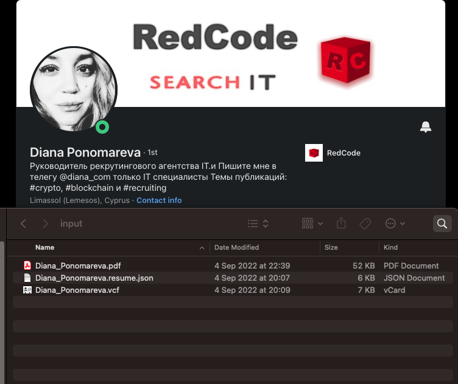
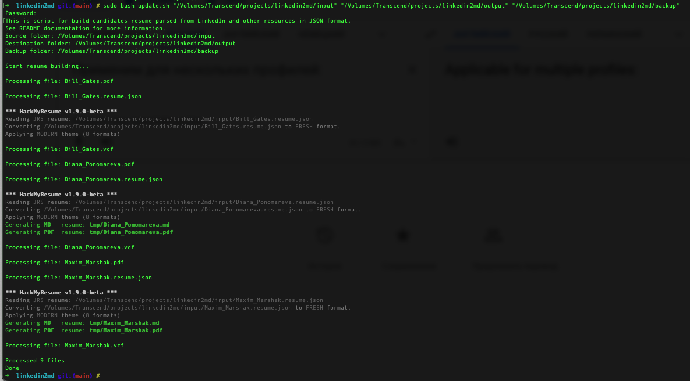

# linkedin2md

This repository illustrates a scheme for building a simple resume/profile database based on a minimalist approach and storing structured profile information in markdown format.

### Basic concepts:

Resumes/profiles come from various sources such as LinkedIn or some job boards.
The input data can come in various formats, and in order to somehow unify this, I took two formats as a basis.

- The first format is the "original" PDF. For example, taken from LinkedIn.

Go to people LinkedIn Profile, [Diana Ponomareva](https://www.linkedin.com/in/diana-ponomareva/) profile for example:

and save it to original PDF:

- The second format is a JSON based on [jsonresume](https://github.com/jsonresume/resume-schema) unified schema.

To get from LinkedIn, I use the [LinkedIn Profile to JSON Resume Browser Tool](https://github.com/joshuatz/linkedin-to-jsonresume) by Joshua Tzucker as a various and simple scraper.

And for Diana:

Additionally, using this extension, you can get a person's contact card in VCF format.

And you'll see saved data in my downloads folder:

Next, I use some utilities to generate a unified MD and PDF stored files.

The solution is very simple: [HackMyResume](https://github.com/hacksalot/HackMyResume) utility create polished resumes and CVs in multiple formats from your command line or shell. Author in clean Markdown and JSON, export to Word, HTML, PDF, LaTeX, plain text, and other arbitrary formats.
Fight the power, save trees. Compatible with FRESH and JRS resumes.

Run:
>bash install.sh
> 
to install bash examples scripts structure. The script uses [jq command line JSON processor](https://github.com/stedolan/jq) for JSON parse, prepares the structure for parsing and installs all necessary dependencies.
 
You can see a project structure:

with input data:

and output structure:

And then run magic shell with yout path parameters:

> sudo bash update.sh "/Volumes/Transcend/projects/linkedin2md/input" "/Volumes/Transcend/projects/linkedin2md/output" "/Volumes/Transcend/projects/linkedin2md/backup"

You can see all profiles transformation process in your Terminal:

and created Diana's profile folder in /output/resume/

Diana's profile contains some files:

- Diana_Ponomareva.summary.md - summary generated markdown file for manually added information
- Diana_Ponomareva.md - resume generated in markdown format
- Diana_Ponomareva.pdf - resume generated in PDF format
- Diana_Ponomareva.original.pdf - original resume PDF file
- Diana_ponomareva.vcf - contact VCF file
- Diana_Ponomareva.resume.json - source JSON file
- artifacts - folder for other manually added artifacts

This is how markdown genereted files looks in my Obsidian:

Diana_Ponomareva.md

Diana_Ponomareva.summary.md

And profiles list file (profiles.md)

And also

Diana_Ponomareva.vcf

Diana_Ponomareva.pdf

Diana_Ponomareva.original.pdf

profiles.md file contains all profiles short data and links. You can run command for rebuild it with tour specific output path:

> sudo bash build.sh "/Volumes/Transcend/projects/linkedin2md/output"

And so, run it again for more profiles:

Results in profiles folder:

profiles.md:

and resumes in markdown:

*Note: In the examples above, I use the sudo command because in my structure the project is in a secure container and access to it is restricted.
In general, the use of sudo is not required.

### Why markdown and resume json format?

- Because it's simple and flexible
- Because it's Open Source and open format
- Because it's well tolerated
- Because it's not cloud and ATS
- Because it's imported to other systems, etc. ATS
- Because it's compatible with scrapers and services like Nubela and others
- Because it's fully markdown and Obsidian (and other markdown processors) compatible

### Data Shaping Approach:

In the same way, you can get JSON resume data from other sources.
For example, from various job boards, transform them and supplement the database.

The json resume format is compatible with scraping services such as [Nubela](https://nubela.io), and you can build an automated scraping system.
I posted an example of how this is done here: [LinkedIn Scrapper worked from Nubela Service, written on Python](https://github.com/bormaxi8080/linkedin-nubela-scraper-demo)

### People search and building mind maps:

Storing a resume in the markdown format gives advantages when exporting it to relational and document-oriented databases,
and also allows you to apply search solutions and solutions that implement link building schemes, in particular graph view and mind map systems.

Graph view:

And BIGGEST graph view:

You can read more about these developments here:

https://help.obsidian.md/Plugins/Graph+view

And how some fully structural system viewed:

### Real use example:

I am currently experimenting with GraphView mappings on a base of over 50,000 non-abstracts real people resume loaded from one of more ATS systems and will post the results of these experiments.

In this concept, I make extensive use of simple search approaches in markdown with Linux commands (sed, sed, awk and other Linux coomands and specific ytilities for search data in PDF, DOCX and other file formats), because it's very simple and useful.

### Restrictions:

*General application:

I haven't tested any of the above on Windows systems as I only use Linux systems.
In general, it is assumed that the readers of this manual have the skills of advanced Linux users.

*Application area:

This development is not commercial or industrial and is intended primarily for the rapid handling of large datasets of people profiles, based on the concepts of working with markdown, without resorting to commercial systems, such as ATS and relational databases.

*About LinkedIn scraping:

LinkedIn is quite difficult to scrape, and direct profile scraping entails a number of problems, such as account bans, captcha, counteraction to security systems, and others.
For scraping LinkedIn profiles I recommend using specialized services such as Nubela.

*About profile photo saving:

This has come up before and I did not categorize it as a bug that can be "fixed", and I'm still reluctant to do so.
The URL that LinkedIn provides for the profile picture is not actually a permanent URL - it looks like some variant of a temporary signed URL. If I make a guess that the e={int} portion of that URL corresponds with expiration, and the integer is a unix timestamp, then it looks like that image should expire in a few months (November). I'm also not sure how consistent LinkedIn is in setting the future expiration - it almost looks like they might batch generate these instead of dynamically generating them on-demand, as loading up my own profile today showed that same e={int} value.
With the knowledge that the profile picture URL might expire at a time outside my control, I'm still torn on whether or not this would be good to include in the JSON output. On the one hand, resumes are often used in the same time period they are generated, so maybe expiring images aren't that big of a deal. On the other hand, I don't want to get blamed if someone uses the image URL as part of their job application or website and it suddenly fails to load.
The easiest solution here, which I mentioned the last time this came up, is for everyone to just not rely on LinkedIn for image hosting; upload your profile picture to something like imgur and then manually fill in the basics.image field.

### TODOs:

- Fix bugs
- Add new cosmetics features
- Publish resumes in Telegram channel(s)
- Updating resumes and tags
- Photo updating
- Show ATS integrations
- Show how to really parse and cracks some job boards
- Show big graph view and mind maps

### Cooperation:

I am looking into collaborating to transform and enrich your resume databases. I have experience in this field for about 7 years. You can read more about my experience in my GitHub profile: [bormaxi8080](https://github.com/bormaxi8080/)

### Donates:

I will be grateful for donations to this project:

> Etherium: 0xe29685d6f0032bccac08b0e745a1a69ef9803973

*Note: Diana gave her permission to show her public LinkedIn profile in this project )